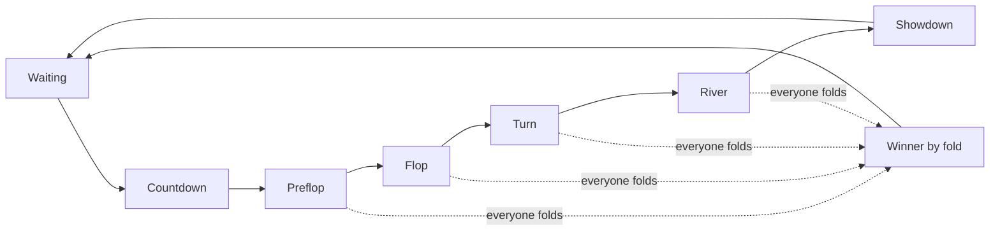

# Poker — Game Play Guide

> For **players** (and anyone explaining the product).  
> This is Texas Hold’em as it works in **ND OS Web** — entertainment only, not a full poker textbook.
>
> Last synchronized with the client action logic: **2026-07-23**.

---

## Architecture (nd-os-web)

| Piece | Where it runs |
|-------|----------------|
| Poker rules / chips / turns | **In the browser** (`PokerTable` engine) |
| Solo / bots | Local host engine only — no network |
| Multiplayer | **Host-authoritative** WebRTC via PeerJS (signaling only; no game server) |
| Profile, bankroll, stats | `localStorage` on this device |

The **host** browser (solo player, or room creator) owns the deck and validates actions. Guests send `fold` / `check` / `call` / `raise` over a peer data channel. This is casual entertainment — the host can see private state; do not treat it as fair ranked play.

---

## Quick start (happy path)

```text
Lobby → Play Against Bot or Create/Join room → sit at an empty seat → wait for countdown
  → blinds post → hole cards dealt → bet (preflop → flop → turn → river)
  → showdown / fold win → chips move → next hand
```

1. Open the **Poker** desktop app and choose **Play Against Bot**, **Create room**, or **Join room**.
2. Tap an **empty seat** to sit (bots auto-fill in solo; hosts can **Add bots**).
3. When enough players are seated, a short **countdown** starts.
4. You get **two private cards** (hole cards). Only you can see their faces (host engine still knows them).
5. When the gold timer is on **your** name pill, it is your turn — use the legal **Fold / Check·Call / Bet·Raise / All-In** actions shown.
6. Community cards appear in the middle (flop → turn → river).
7. At the end, the pot goes to the winner(s). A new hand starts automatically.

---

## Lobby & tables

| Room type | What it means |
|-----------|----------------|
| **Play Against Bot** | Solo table; bots fill empty seats locally |
| **Casual — Create room** | You become the host; share the PeerJS room code |
| **Join room** | Paste a host room code to connect peer-to-peer |
| **How to play** | In-app rules slides (deal, streets, hand rankings) |
| **Leaderboard** | Local stats for this device (name, bankroll, hands, wins) |

- After you sit, **other empty seats look disabled** so you do not try to take a second seat.
- Display name, avatar, and bankroll are saved locally and survive refresh.
- **Daily claim** — once per local calendar day, claim **+10,000** chips from the lobby (on top of your current bankroll).
- **Resume after reload** — solo/host table state is saved locally and auto-resumes when you reopen Poker. Host gets a **new** room code (share it again). Guests try to rejoin the previous host; if the host is gone, resume fails and returns to the lobby.

---

## Seats & “You”

- Your seat is labeled **You** (with your avatar and chip stack).
- Other players show a name (guest, display name, or bot) and stack.
- Tap **your avatar** to change it while seated.
- **Leave / exit** returns you to the lobby (you leave the table).

---

## Position badges (D / SB / BB)

Small round badges on a seat. They mark **roles for this hand only** and move each hand.

| Badge | Name | Meaning |
|-------|------|---------|
| **D** | Dealer (button) | Last to act after the flop. Blinds sit to the left of the dealer. |
| **SB** | Small Blind | Posts the smaller forced bet; usually first to act after the flop. |
| **BB** | Big Blind | Posts the larger forced bet; last to act **preflop**. |

Badges sit **to the right of the avatar** (same for you and opponents), above the name pill and clear of hole cards.

---

## Chips, blinds & pot

- **Stack** — chips on your seat (shown next to your name).
- **Blinds** — forced bets at the start of each hand (SB then BB). Table stakes come from table config (e.g. `smallBlind` / `bigBlind`).
- **Bet in front of a seat** — chips that player has put in this betting round.
- **Pot** — chips in the middle. At showdown (or when everyone else folds), the pot is awarded.

The **host engine** owns chip math. The UI only displays what the table state says.

---

## Cards

| Cards | Who sees faces? |
|-------|-----------------|
| **Your hole cards** (2) | Only you (face-up on your seat) |
| **Opponents’ hole cards** | Face-down until showdown / all-in reveal |
| **Board** (up to 5) | Everyone — flop (3), turn (1), river (1) |

Best hand = best **five-card** poker hand from your two hole cards + the board (you may use 0, 1, or 2 hole cards).

---

## Hand flow (streets)



| Stage | What happens |
|-------|----------------|
| **Waiting** | Not enough players / between hands |
| **Countdown** | “Next hand” timer — get ready |
| **Preflop** | Hole cards dealt; betting starts (BB acts last) |
| **Flop** | Three community cards; betting |
| **Turn** | Fourth community card; betting |
| **River** | Fifth community card; last betting round |
| **Showdown** | Remaining players’ cards compared; pot paid |
| **Cinematic all-in** | Special all-in runout UI — action bar hidden |

---

## Your turn vs waiting

### It is your turn when

- A **gold progress border** runs around **your** name/balance pill, **and**
- The **action bar** shows: Fold, Check/Call, bet slider, Raise/Bet, All-In.

Only the player whose turn it is sees that full action bar. Others see the timer on that seat’s pill.

### When it is not your turn

- No gold border on your pill.
- No Fold/Call/Raise bar.
- You may still see **pre-action** options (e.g. Auto Fold / Check·Fold / Call Any) if you are still in the hand — those fire automatically when your turn arrives.

### Turn timer

- Gold border shrinks as time runs out (then orange / red).
- If time runs out, the host engine auto-acts (typically **check** if free, else **fold**).
- Everyone at the table should see the timer on the **acting** seat.

---

## Actions (what each button does)

| Control | When | Effect |
|---------|------|--------|
| **Fold** | Always on your turn | Discard your hand; you are out of this pot |
| **Check** | Nothing to call | Pass without putting more chips |
| **Call** | Facing a bet | Match the payable amount, or commit your shorter stack if you cannot fully match it |
| **Bet / Raise** | A funded opponent can still respond | Put more chips in using the legal slider range |
| **All-In** | Your full remaining stack is legal | Commit your remaining stack, or make a short-stack all-in call |
| **Pre-actions** | Off your turn | Queue fold / check-fold / call-any for your next turn |

**Raise amount** in this app = chips **added this action** (not the final total bet). The slider respects engine `minRaise` / `maxRaise` / call amount.

### Check, bet, call, and raise

- When the amount to call is `0`, the main passive action is **Check**. A legal
  **Bet** may still be available; checking does not remove the right to bet.
- When facing a bet, the passive action is **Call** and shows the amount you
  actually need to pay.
- **Bet / Raise** is available only when the amount is inside the legal minimum,
  maximum, stack, and room-config limits.
- A raise also requires at least one other active player with chips who can
  respond. An opponent who has folded or is already all-in cannot respond to a
  new raise.

### All-In and call-only situations

The **All-In** label always stays “All-In,” but the legal action behind it
depends on the situation:

| Situation | Correct controls | Chips committed |
|-----------|------------------|-----------------|
| No bet to call and a shove is legal | Check, Bet/Raise, All-In | All-In commits your remaining stack |
| Facing a bet and a funded opponent can respond | Fold, Call, Raise, All-In | All-In commits your remaining stack |
| Heads-up opponent is already all-in and you cover them | Fold and Call only | Call commits only the payable call amount; surplus chips remain in your stack |
| The call equals or exceeds your whole stack | Fold, Call, All-In | Call/All-In commits only your remaining stack |
| Multiway: one player is all-in but another funded player remains | Fold, Call, Raise, All-In when otherwise legal | A raise can build a side pot against the funded player |

> **Example:** Player A is all-in for `50,000` and you have `100,000`.
> In heads-up play, you may **Fold** or **Call 50,000**. You may not raise a
> player who has no chips left to respond, so **Raise** and **All-In** are
> disabled. Calling leaves your other `50,000` in your stack.

If the amount to call is larger than your stack, the client displays and sends
the payable amount as `min(call amount, stack)`. This is a legal short-stack
all-in call; it does not create a raise.

### Slider and private-room limits

The slider range is recalculated for every turn from the latest table state:

- Lower bound: the legal minimum bet/raise from the host engine.
- Upper bound: the smallest of engine `maxRaise`, your remaining stack, and the
  room’s remaining per-hand investment limit.
- **All-In** is enabled only when that legal upper bound reaches your complete
  remaining stack.
- If the room cap stops below your stack, the slider stops at the cap and
  **All-In** is disabled.
- If the remaining room allowance is below the legal minimum while you still
  have chips, Bet/Raise is disabled instead of sending an invalid value.
- A genuine short-stack all-in below the normal minimum remains legal when it
  commits your entire remaining stack.

The client rechecks these limits immediately before submitting an action so a
stale slider or delayed table update cannot send an out-of-range bet.

---

## Winning & showdown UI

1. **Fold win** — everyone else folds; winner takes the pot (hole cards may stay private).
2. **Showdown** — remaining hands are compared.
3. **Chat** shows hole cards | board (up to 7 mini cards) for the winner when available.
4. **Winner popup** shows the same idea: **2 hole + 5 board**, with glow on cards that make the winning hand (when the engine provides that data).
5. Chips animate to the winner; then the table returns toward **waiting** / next countdown.

Split pots / multi-winner cases may simplify the popup; chat still carries the result text.

---

## Bots & solo tables

- **Play Against Bot** auto-fills bots so a hand can start with one human.
- Host rooms can press **Add bots** to fill empty seats.
- Bot seats play automatically; you still use the same Fold/Call/Raise UI on your turns.

---

## Disconnect & leave (what to expect)

- Leaving the table stands you up and returns you to the lobby (chips cash out into local bankroll).
- If a guest disconnects mid-hand, the host clears their seat (entertainment-simple policy). Rejoin with the room code and sit again.
- Do not rely on disconnect to “pause” a hard decision — the host clock keeps running.

---

## UI cheat sheet

| UI piece | Meaning |
|----------|---------|
| Empty seat ring | Sit here (disabled if you already have a seat) |
| **You** + stack | Your seat |
| Gold pill border | That seat’s turn timer |
| D / SB / BB | Dealer / small blind / big blind this hand |
| Board in center | Shared community cards |
| Pot badge / chips | Current pot |
| Action bar | Your turn only |
| Pre-action bar | Queue an action while waiting |
| Winner popup | End-of-hand result |

---

## Simple decision flow (player)

```text
Is the gold timer on my seat?
  NO  → wait (optional: set Auto Fold / Check·Fold / Call Any)
  YES → look at hole cards + board + amount to call
        ├─ weak / don’t want to continue → Fold
        ├─ nothing to call               → Check
        ├─ want to stay, match bet       → Call
        └─ want to pressure / build pot  → Raise or All-In
```

---

## Related docs (developers)

| Doc / code | Audience |
|------------|----------|
| In-app **How to play** slides | Players in the Poker lobby |
| `src/features/apps/poker/engine/` | Hold’em engine + Vitest cases |
| `src/features/apps/poker/net/p2p-session.ts` | PeerJS host/guest session |
| `src/features/apps/poker/store/profile.ts` | Local profile / bankroll |

> Older external PRDs (`prd/000x-*.md`, REST/WebSocket poker APIs) are **not** used by nd-os-web.

---

## Client and host-engine action contract

The **host engine** remains authoritative for turn order, chips, pots, action
results, and the `allowedActions` list. Guests and the local UI use that state
and add defensive gating so impossible actions are not presented or submitted.

For every acting player, the engine provides:

- `allowedActions`
- `callAmount`
- `minRaise`
- `maxRaise`
- player `chips`, `currentBet`, and status
- table/room bet-limit configuration

When all remaining opponents are already all-in, the engine omits `raise` from
`allowedActions` and exposes only the legal response, normally **Fold / Call**.
In a short-stack call, the legal wire action remains `call` even when that call
uses the player’s whole stack.

The client protects both cases:

1. It disables Bet/Raise and raise-style All-In when no funded opponent can
   respond.
2. It converts a displayed short-stack All-In call to the legal `call` action
   and caps the payable amount at the player’s stack.

These checks improve UX; the host engine still rejects illegal, out-of-turn,
stale, or out-of-range actions from guests.

---

## QA and PM action reference

### Product rules in one minute

1. Actions are available only to the confirmed seated player whose turn it is.
2. **Check** means the payable call is zero; **Call** means it is greater than
   zero.
3. **Bet / Raise** requires a legal amount and at least one active opponent with
   chips who can respond.
4. **All-In** is a full-stack action. It is not a shortcut for sending the
   largest room-configured raise when that value is below the player’s stack.
5. A player may call all-in with a short stack. That remains a `call`, capped
   at the stack, even though the UI may also offer the **All-In** button.
6. A heads-up player cannot raise after the only opponent is already all-in.
7. In a multiway hand, raising may continue after one player is all-in if
   another active player with chips can respond and form a side pot.
8. The room’s configured limit can narrow the slider or disable raising and
   All-In. The client must never silently exceed that limit.
9. Once an action is submitted, the controls lock until a newer authoritative
   table state confirms what happened.

### Acceptance matrix

Use this matrix for manual QA, regression testing, and PM sign-off.

| Scenario | Expected main actions | Slider / value expectation | Expected submission |
|----------|-----------------------|----------------------------|---------------------|
| It is not the player’s turn | No live action bar | Not interactive | No action request |
| Free action; betting is legal | Fold, Check, Bet/Raise, All-In | Legal minimum through full stack, subject to config | Check sends `check`; bet uses `raise` with the added amount |
| Facing a bet; funded opponent remains | Fold, Call, Raise, All-In | Legal raise range, subject to stack and config | Call sends `call`; raise/all-in sends `raise` with the added amount |
| Heads-up opponent is all-in; player covers | Fold and Call | Raise slider disabled | Call sends `call`; no raise-style request |
| Call is greater than or equal to player’s stack | Fold, Call, All-In | Payable call equals the remaining stack | Call or All-In sends `call` |
| One opponent is all-in; a third funded player remains | Fold, Call, Raise, All-In when permitted | Legal side-pot raise range | Raise/all-in may send `raise` |
| Room cap is below the player’s stack but at least the minimum | Fold, Check/Call, Raise | Slider maximum equals remaining cap; All-In disabled | Raise amount never exceeds cap |
| Remaining room cap is below the minimum and player has chips left | Fold and Check/Call | Raise and All-In disabled | No raise request |
| Player’s entire short stack is below the normal minimum | Fold, Check/Call, All-In when otherwise legal | Minimum and maximum equal the full short stack | Full-stack `raise`, or `call` when facing an unmatchable bet |
| Engine omits `raise` from `allowedActions` | No Bet/Raise action | Slider unavailable | No raise request |
| User taps an action twice before state updates | First tap accepted; controls immediately lock | No second value can be submitted | At most one action request |

### Wire-action examples

The values below describe the current client contract. Amounts are chips added
by this action, not the player’s final total contribution.

```json
{ "action": "check" }
```

```json
{ "action": "call" }
```

```json
{ "action": "raise", "amount": 50000 }
```

An All-In that is legally a raise uses the final form with the player’s full
remaining stack as `amount`. An All-In that is legally only a short-stack call
uses `{ "action": "call" }`; the host engine applies the payable amount.

### Questions QA or PM may ask

#### Why can I only call after another player goes all-in?

In heads-up play, the all-in player has no chips left and cannot respond to a
raise. If you cover that player, the legal choices are Fold or Call. Calling
matches only the outstanding amount; your surplus chips stay in your stack.

#### Why is Raise disabled but All-In is available?

This is correct only when calling consumes your entire remaining stack. The
displayed All-In is then a short-stack **call**, not a raise. If you still have
chips after calling and no funded opponent can respond, both Raise and All-In
must be unavailable.

#### Why is All-In disabled while Raise is available?

The room’s remaining investment cap or engine maximum is below the player’s
stack. A raise up to that cap is legal, but committing the full stack would
violate the configuration.

#### Why does the slider not reach the whole stack?

Its maximum is constrained by the latest engine maximum, the player’s stack,
and the room’s remaining per-hand limit. The smallest applicable value wins.

#### Why can raising continue when one player is already all-in?

Another active player still has chips and can respond. Those players can
continue betting into a side pot; the all-in player remains eligible only for
the pot portions they funded.

#### Does an All-In button always send an `all-in` action?

No. The visible label describes the player outcome, while the wire action
describes the legal poker operation. A raise-style shove sends `raise`; an
all-in call sends `call`.

### QA evidence to capture

For any action bug, record:

- table/room id and hand or round number
- acting player stack and current bet
- highest table bet and displayed call amount
- `allowedActions`, `minRaise`, and `maxRaise`
- room maximum-bet configuration and remaining allowance
- every active player’s status and remaining chips
- which buttons and slider bounds the UI displayed
- the submitted action payload
- the next authoritative table state or host error

This evidence is enough to decide whether the issue is client presentation,
client submission, stale state, or host-engine action/state logic.

---

## Glossary

| Term | Short definition |
|------|------------------|
| Hole cards | Your two private cards |
| Board / community | Shared cards in the middle |
| Street | Betting round (preflop, flop, turn, river) |
| Pot | Chips contested this hand |
| Stack | Your remaining chips at the table |
| Showdown | Reveal and compare hands after the river (or all-in runout) |
